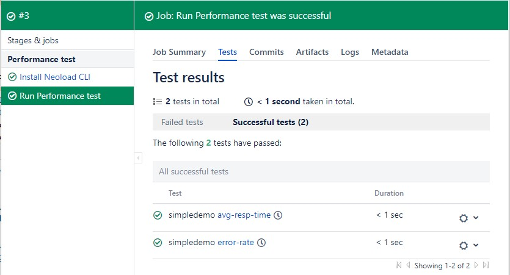

# Bamboo Pipeline Examples
These examples demonstrate how the NeoLoad CLI simplifies the syntax required to
 execute load tests from within a Bamboo pipeline.

## TL;DR
 - Create a **bamboo project** and name it with the initials "PT"
 - Set values for the 3 variables in *bamboo.yaml*: 'api_url', 'token_secret' and 'zone_id'
 - Push *bamboo.yaml* to your Neoload project repository
 - Set up Spec Repository in Bamboo and link the repository

## How to
 - In Bamboo, from the Create top menu, create a project and name it with initials "PT". These initials are the *project key* in bamboo.yaml.
 - In your repository, create the file bamboo.yaml in the folder bamboo-specs.
  This folder must be located at the **root of the repository**.
 - Paste the content of either *bamboo-v1.yaml* or *bamboo-v2.yaml* in your bamboo.yaml and push it to your repository.

   - **bamboo-v1.yaml works with Bamboo 6.3 and later** 
    In bamboo-v1.yaml, replace these 3 placeholders with your own values:
      - *<api_url>* &nbsp;&nbsp;&nbsp;&nbsp;&nbsp;&nbsp;&nbsp;&nbsp;&nbsp;&nbsp;&nbsp;&nbsp;&nbsp; Example: https://neoload-api.saas.neotys.com
      - *<token_secret>* &nbsp;&nbsp;&nbsp;&nbsp; Your NLWeb API token
      - *<zone_id>* &nbsp;&nbsp;&nbsp;&nbsp;&nbsp;&nbsp;&nbsp;&nbsp;&nbsp;&nbsp;&nbsp;&nbsp; Example: "defaultzone"
   - **bamboo-v2.yaml works with Bamboo 6.9 and later** 
    In bamboo-v2.yaml, replace these 3 variables with your own values:
      - *api_url* &nbsp;&nbsp;&nbsp;&nbsp;&nbsp;&nbsp;&nbsp;&nbsp;&nbsp;&nbsp;&nbsp;&nbsp;&nbsp; Example: https://neoload-api.saas.neotys.com
      - *token_secret* &nbsp;&nbsp;&nbsp;&nbsp; Your NLWeb API token. It must be encrypted with Bamboo spec encryption tool
      - *zone_id* &nbsp;&nbsp;&nbsp;&nbsp;&nbsp;&nbsp;&nbsp;&nbsp;&nbsp;&nbsp;&nbsp;&nbsp; Example: "defaultzone"
 
 - In the Specs Bamboo menu > Setup Spec Repository, link the project to your repository (check "Link new repository").
 
 The pipeline should start and run your performance test!
 
> To update the yaml file, push the updated bamboo.yaml to Git and reload it in Bamboo: 
> Settings > Linked Repositories > Choose the repository > Spec status: click the Scan button.

## SLA Reporting via JUnit
The job will display SLA results in the Tests tab. It will fail if one SLA fails, and succeed if no SLA is broken. 

