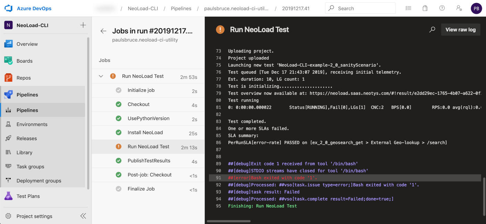
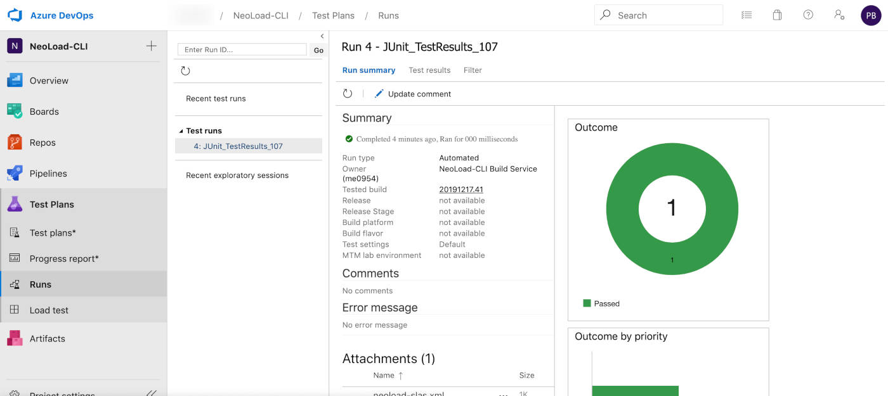

# Azure DevOps Pipeline Examples
These examples demonstrate how the NeoLoad CLI simplifies the syntax required to
 execute load tests from within an Azure DevOps pipeline.

By default, standard Azure pipeline agent images come with Python 3 installed.
 There is no need to pre-install Python, simply add a step that runs:
'''
pip install neoload
neoload --profile default --token [your NeoLoad Web token] --zone [a Zone code]
'''

## SLA Reporting via JUnit

The NeoLoad CLI can export JUnit-style reports about SLA pass/fail data, which
 can then be provided back to the Azure DevOps Pipeline as test results.

See example pipelines below for steps to produce and consume jUnit SLA reports.

## Using a Zone with infrastructure already available

Example pipeline: [neoload-cli-dyninfra.yml](neoload-cli-dyninfra.yml)

There are two situations where you can simply expect that resources, controllers
 and load generators, are ready for use in a NeoLoad Web Zone:

 - A Dynamic Infrastructure Zone, such as OpenShift or AWS
 - A static zone that already has one or more controllers and load generators attached and not in use

This is the simplest form of NeoLoad test within a pipeline, where resources are
 simply available for use at any moment when the pipeline can be executed.

## Using a Zone for DIY supply/demand of infrastructure

Example pipeline: [neoload-cli-docker.yml](neoload-cli-docker.yml)

An alternative model to the above situations is for the pipeline itself to
 provision controllers and load generators (typically as Docker containers), attaching
 them to NeoLoad Web temporarily, running the test, then disposing of the containers.

This approach has a few distinct advantages:

 - Use the container provisioning model native to your pipeline
 - The pipeline manages it's own "supply" to satisfy it's "demand" for infrastructure
 - Infrastructure can be re-used during a multi-stage testing pipeline (sanity then full test)
 - Complete control over controller and load generator configuration before execution
 - Access to logs and raw results after test execution via controller volume file I/O
